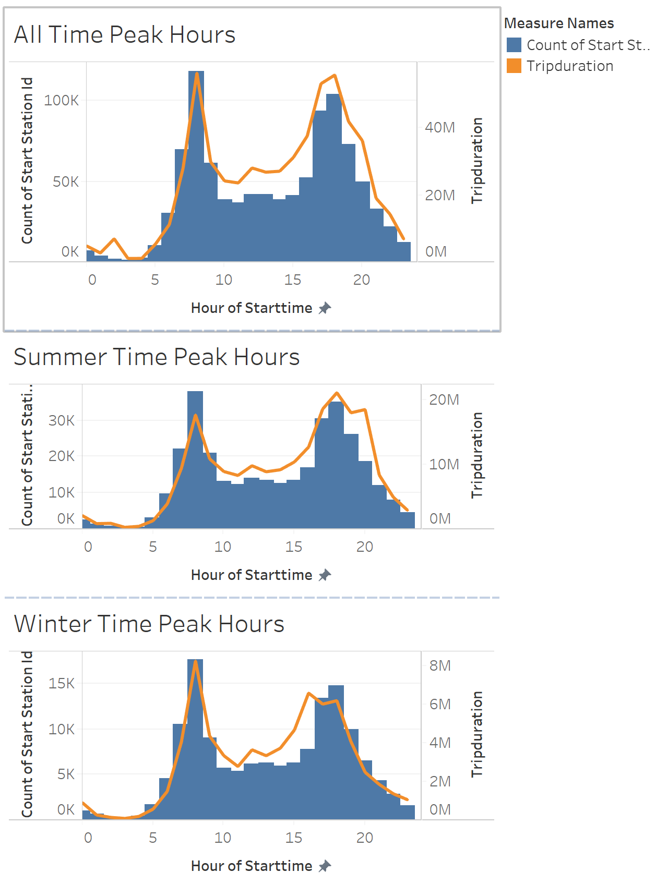
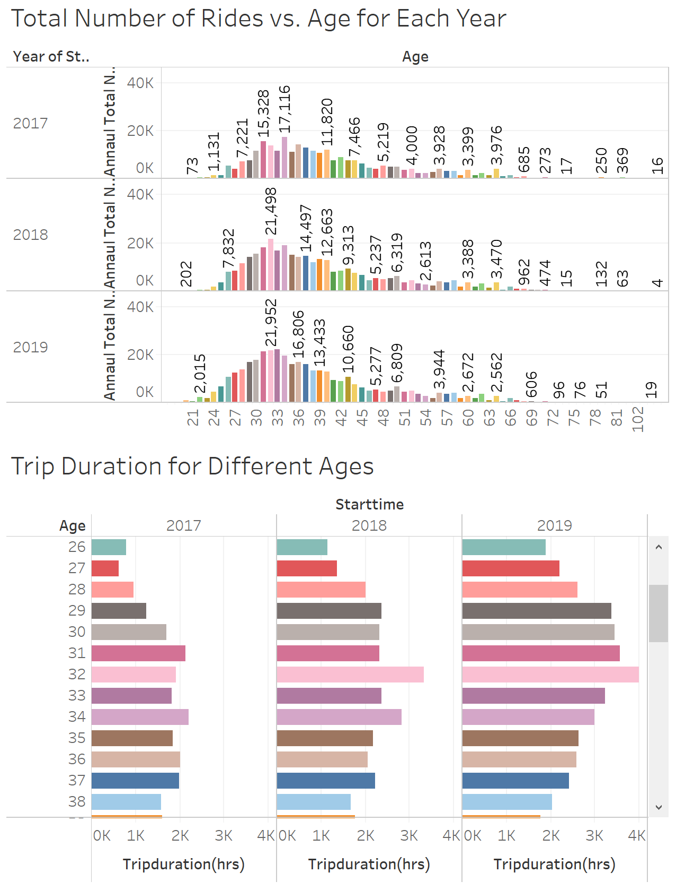
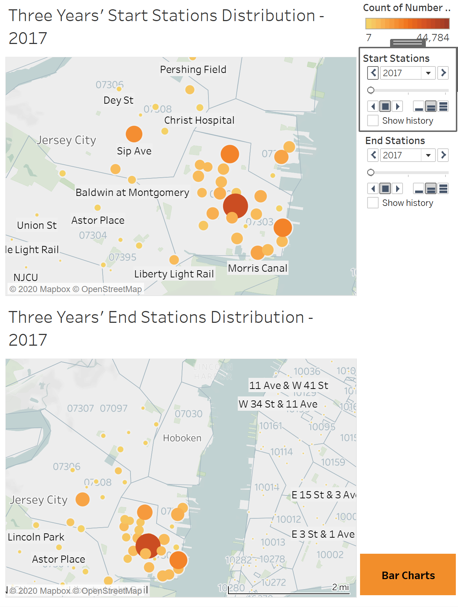
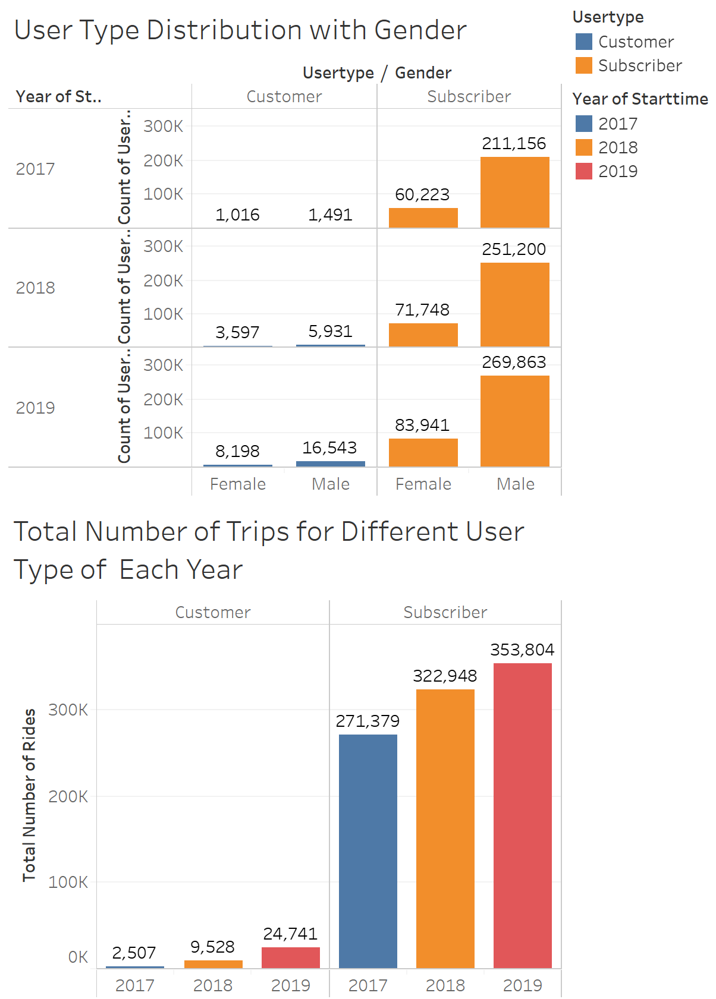

# Jercey City- Citi Bike Analytics
 Citi-Bike-Analytics-NYC

## Background

Congratulations on your new job! As the new lead analyst for the [New York Citi Bike](https://en.wikipedia.org/wiki/Citi_Bike) Program, you are now responsible for overseeing the largest bike sharing program in the United States. In your new role, you will be expected to generate regular reports for city officials looking to publicize and improve the city program.

Since 2013, the Citi Bike Program has implemented a robust infrastructure for collecting data on the program's utilization. Through the team's efforts, each month bike data is collected, organized, and made public on the [Citi Bike Data](https://www.citibikenyc.com/system-data) webpage.

However, while the data has been regularly updated, the team has yet to implement a dashboard or sophisticated reporting process. City officials have a number of questions on the program, so your first task on the job is to build a set of data reports to provide the answers.

## Analysis

* Click [here](https://public.tableau.com/profile/hao.chu#!/vizhome/NYC-Citi-Bike-Analytics/Story-JerceyCity) to view complete Tableau Workbook online.

**Phenomenon 1. Peak Hours**

From year 2017 to year 2019 for both number of trips and total durations, it appeared that there were two peaks during a day, namely, 8:00 in the morning and 5:00 to 6:00 in the afternoon. this might be due to the fact that people started trips at around 8am to go working, exercising, enjoying life on the weekends, meeting friends, hiking and etc. And during 5 - 6pm, people started getting off works, going back home, going for dinners, going to the beaches and etc. Thus, during these two periods, the number of trips and total trip hours increased to maximum. 

From the 3 bar charts, we can see that the described phenomenon stays true for both summer and winter time. but the total amount of trips and trip hours were both almost 50% less in winter than those in summer. This might be because of the cold weather in winter, people would rather take public transport or driving private vehicles instead.

**Phenomenon 2. Number of Rides and Tirp Duration vs. Ages**

First of all, from the data we can see that there were a few amounts of age which were over 100, with the maximum of 132, this could be considered as the outlier of the data. People just randomly input their date of birth. Despite of this, the graph illustrates a shifted normal distribution for all three year. People aged around 30 to 33 seemed to be the most active group who had the highest number of rides as well as the longest time of trips.  

And due to the fact that more and more registered users joined from 2017-2019(Citi Bike get more popular each year), the number of total trips and total trip hours increased annually. But the other fact is that it is slowly getting to its saturation stage as we can see the increase in 2019 is not that much.

**Phenomenon 3. Popular Stations Analysis**

 [Popular-Stations-2018](Images/Popular-Stations-2018.PNG) [Popular-Stations-2019](Images/Popular-Stations-2019.PNG)

For this analysis, there are two dashboards, one is the station distribution on the map, the other is the bar charts listing all stations. From the distribution map, we can see that from year 2017 to 2019, the most popular starting and ending stations have not been changed too much. The most popular station was Grove St PATH for both the starting and ending stations. However, the top 10 starting and ending stations changed slightly. Exchange Place station decreased dramatically in year 2019, while Marin Light Rail station, Washington St station, Journal Square station and Harborside station started to grow. 

Also, from the top 10 starting and ending stations listed, we can see that a large number of trips were short-distance ones, while there were also a few long-distance trips where people rode all the way from Jersey City to New York City. 

Stations along the coastline got more popular through the three years as well. People tended to spent more time for breaks and enjoying their life.

**User Phenomenon 4. User Type and Gender for Each Year**

From year 2017 to year 2019, both the numbers of customer and subscriber users increased. The number of male users has always been bigger than that of female users.

While it was increasing, the number of causal customers didn't increase very much whereas people tend to register and become members instead of just to be as customers.

From 2017 to 2018, Citi Bike program was really popular and the number of subscribers increased by 20%. From 2018 to 2019, the rate decreased to 11%.

Not to mention that in year 2019, the percentage increase of subscribers declined while the percentage increase of daily customers climbed heavily. As this program was getting more and more popular, visitors to this city tended to ride bikes along with their trips.
